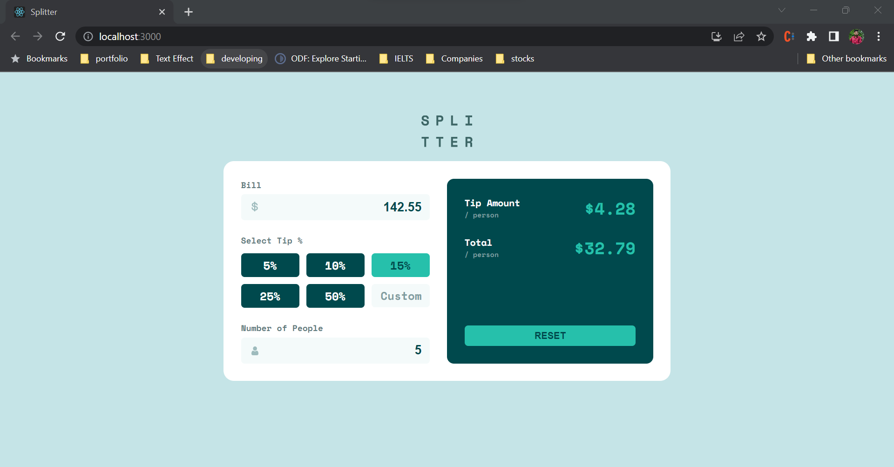

# Frontend Mentor - Tip calculator app solution

This is a solution to the [Tip calculator app challenge on Frontend Mentor](https://www.frontendmentor.io/challenges/tip-calculator-app-ugJNGbJUX). Frontend Mentor challenges help you improve your coding skills by building realistic projects.

## Table of contents

- [Overview](#overview)
  - [The challenge](#the-challenge)
  - [Screenshot](#screenshot)
  - [Links](#links)
- [My process](#my-process)
  - [Built with](#built-with)
  - [What I learned](#what-i-learned)
  - [Useful resources](#useful-resources)
- [Author](#author)

## Overview

### The challenge

Users should be able to:

- View the optimal layout for the app depending on their device's screen size
- See hover states for all interactive elements on the page
- Calculate the correct tip and total cost of the bill per person

### Screenshot



### Links

- Solution URL: [https://github.com/deep041/tip-calculator]
- Live Site URL: [https://tip-calculator-one-amber.vercel.app/]

## My process

### Built with

- HTML5
- CSS
- CSS Grid
- [React](https://reactjs.org/) - JS library

### What I learned

```css
@keyframes inputError {
    0% { transform: translate(1px, 1px) rotate(0deg); }
    10% { transform: translate(-1px, -2px) rotate(-1deg); }
    20% { transform: translate(-3px, 0px) rotate(1deg); }
    30% { transform: translate(3px, 2px) rotate(0deg); }
    40% { transform: translate(1px, -1px) rotate(1deg); }
    50% { transform: translate(-1px, 2px) rotate(-1deg); }
    60% { transform: translate(-3px, 1px) rotate(0deg); }
    70% { transform: translate(3px, 1px) rotate(-1deg); }
    80% { transform: translate(-1px, -1px) rotate(1deg); }
    90% { transform: translate(1px, 2px) rotate(0deg); }
    100% { transform: translate(1px, -2px) rotate(-1deg); }
}
```

### Useful resources

- [https://www.w3schools.com/howto/howto_css_shake_image.asp] - This helped me for shake animation CSS. I used this for showing input type shaking while error comes.

## Author

- Website - [https://deep041.github.io/deeppatel/]
- Frontend Mentor - [@deep041]